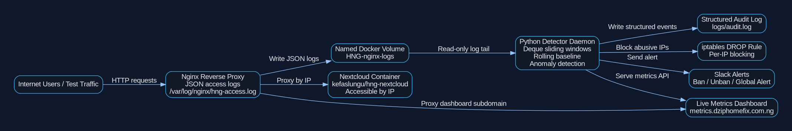

# HNG Stage 3 DevOps Track: Real-Time HTTP Anomaly Detection and DDoS Response Engine

## Project Overview

This project is a real-time HTTP anomaly detection and DDoS response engine built for the HNG Stage 3 DevOps Track task.

The system runs beside a pre-built Nextcloud Docker image and continuously monitors all incoming HTTP traffic through Nginx JSON access logs. It learns recent traffic behaviour, detects abnormal traffic spikes from individual IP addresses or from the global traffic stream, sends Slack alerts, blocks suspicious IP addresses with `iptables`, automatically unbans IPs using a backoff schedule, writes structured audit logs, and exposes a live metrics dashboard.

The provided Nextcloud image was not modified or replaced. All detection, alerting, blocking, logging, and dashboard functionality is implemented separately in the custom detector service.

---

## Live Submission Details

- **Server IP:** `13.42.74.134`
- **Metrics Dashboard URL:https://metrics.dziphomefix.com.ng
- **GitHub Repository:https://github.com/soyoyeyinka/hng-stage3-anomaly-detector
- **Blog Post:https://medium.com/@soyoyeolayinka35/building-a-real-time-http-anomaly-detection-engine-with-python-nginx-docker-and-iptables-73ca4af387c7
- **GitHub Repository:https://github.com/soyoyeyinka/hng-stage3-anomaly-detector

Nextcloud is accessible by server IP only, while the detector dashboard is served through the dashboard subdomain.

---

## Key Requirements Implemented

- Linux VPS provisioned on AWS EC2
- Minimum required server size met with 2 vCPU and 2GB RAM
- Nextcloud deployed using Docker Compose
- Required Nextcloud image used: `kefaslungu/hng-nextcloud`
- Nginx configured as a reverse proxy in front of Nextcloud
- Nginx configured to write JSON access logs
- Nginx logs written to `/var/log/nginx/hng-access.log`
- Required named Docker volume used: `HNG-nginx-logs`
- Detector mounts Nginx log volume read-only
- Real client IP forwarding configured with `X-Forwarded-For`
- Python daemon runs continuously beside Nextcloud
- No cron job or one-shot script used
- No Fail2Ban used
- No rate-limiting library used
- Sliding-window logic implemented manually with `deque`
- Rolling 30-minute baseline implemented
- Per-hour baseline slots implemented
- Z-score and multiplier anomaly detection implemented
- Error surge threshold tightening implemented
- Per-IP anomaly blocking implemented with `iptables`
- Global anomaly Slack alert implemented without global blocking
- Slack ban, unban, and global anomaly alerts implemented
- Auto-unban backoff schedule implemented
- Live dashboard refreshes every 3 seconds
- Structured audit log implemented
- Required evidence screenshots captured

---

## Technology Stack

| Component | Technology |
|---|---|
| Cloud provider | AWS EC2 |
| Operating system | Ubuntu Linux |
| Container orchestration | Docker Compose |
| Reverse proxy | Nginx |
| Application | Nextcloud |
| Detector language | Python |
| Dashboard | Flask |
| System metrics | psutil |
| Configuration | YAML |
| Alerts | Slack Incoming Webhook |
| Blocking | iptables |
| Logs | JSON Nginx access logs |

---

## Repository Structure

```text
detector/
  main.py
  monitor.py
  baseline.py
  detector.py
  blocker.py
  unbanner.py
  notifier.py
  dashboard.py
  config.example.yaml
  requirements.txt
  Dockerfile

nginx/
  nginx.conf

docs/
  architecture.png
  architecture.dot

screenshots/
  Tool-running.png
  Ban-slack.png
  Unban-slack.png
  Global-alert-slack.png
  Iptables-banned.png
  Audit-log.png
  Baseline-graph.png

docker-compose.yml
README.md
.gitignore
```

---

## Architecture



### Architecture Explanation

The system is made up of three main services running through Docker Compose:

1. **Nginx Reverse Proxy**
   - Receives HTTP requests from users.
   - Routes IP-based traffic to Nextcloud.
   - Routes `metrics.dziphomefix.com.ng` to the detector dashboard.
   - Writes JSON-formatted access logs to `/var/log/nginx/hng-access.log`.

2. **Nextcloud**
   - Runs the required image: `kefaslungu/hng-nextcloud`.
   - The image is not modified.
   - Nextcloud is accessible by server IP only.

3. **Detector**
   - Continuously tails the Nginx JSON access log.
   - Tracks traffic rates using deque-based sliding windows.
   - Learns normal traffic using rolling baselines.
   - Detects per-IP and global anomalies.
   - Blocks suspicious IPs with `iptables`.
   - Sends Slack alerts.
   - Writes audit logs.
   - Serves the live metrics dashboard.

---

## Docker Volume Design

The stack uses the required named Docker volume:

```text
HNG-nginx-logs
```

Nginx writes access logs to this volume.

The detector mounts the same volume as read-only and continuously reads:

```text
/var/log/nginx/hng-access.log
```

This allows the detector to observe live HTTP traffic without modifying the Nextcloud image.

---

## Nginx JSON Access Log

Nginx is configured to write access logs in JSON format.

Example log entry:

```json
{
  "source_ip": "203.0.113.77",
  "timestamp": "2026-04-28T08:30:00+00:00",
  "method": "GET",
  "path": "/ban-test",
  "status": 200,
  "response_size": 1024,
  "host": "metrics.dziphomefix.com.ng",
  "user_agent": "curl/8.5.0"
}
```

The required minimum fields are included:

- `source_ip`
- `timestamp`
- `method`
- `path`
- `status`
- `response_size`

The detector parses each log line as a JSON object and uses it for traffic analysis.

---
Real Client IP Handling

Nginx is configured to trust and forward the real client IP using the `X-Forwarded-For` header.

Relevant Nginx configuration:

```nginx
set_real_ip_from 0.0.0.0/0;
real_ip_header X-Forwarded-For;
real_ip_recursive on;
```

The upstream requests also include:

```nginx
proxy_set_header X-Real-IP $remote_addr;
proxy_set_header X-Forwarded-For $proxy_add_x_forwarded_for;
proxy_set_header X-Forwarded-Proto $scheme;
```

This ensures the detector works with the real request source IP rather than only seeing internal container addresses.

---

Why Python Was Used

I used Python because it is readable, fast to develop with, suitable for daemon-style monitoring, and easy to explain in a beginner-friendly way.

Python also provides `collections.deque`, which is ideal for implementing true sliding-window logic without using rate-limiting libraries.

Main Python libraries used:

- `Flask` for the dashboard
- `PyYAML` for configuration
- `requests` for Slack alerts
- `psutil` for CPU and memory metrics
- `collections.deque` for sliding windows
- `subprocess` for running `iptables` commands

No Fail2Ban or external rate-limiting library was used.

---
 Detector Daemon

The detector is a continuously running Python service started by Docker:


CMD ["python", "main.py"]


It starts multiple background threads:

- Log monitoring thread
- Baseline recalculation thread
- Auto-unban thread
- Flask dashboard server

This makes the detector a live daemon, not a cron job and not a one-time script.

---
Sliding Window Design

The detector tracks request rates using two main 60-second deque-based windows:

```python
global_window = deque()
ip_windows[ip] = deque()
```

Global Window

The global window stores timestamps for all requests.

It answers the question:

How many requests did the whole system receive in the last 60 seconds?

 Per-IP Window

Each source IP has its own deque.

It answers the question:

How many requests did this specific IP make in the last 60 seconds?


Eviction Logic

Every time a request is processed, the detector removes old timestamps that are outside the 60-second window.

```python
cutoff = now - window_seconds

while dq and dq[0] < cutoff:
    dq.popleft()
```

The current request rate is then calculated as:

```text
requests_in_window / 60
```

This is a real sliding-window implementation because the window moves continuously with time. It is not a fake per-minute counter.

---

## Baseline Design

The detector does not rely on hardcoded traffic values. Instead, it learns recent traffic behaviour.

It maintains per-second request counts for a rolling 30-minute period.

Every 60 seconds, the detector recalculates:

- Mean request rate
- Standard deviation
- Error rate

Configuration:

```yaml
baseline_window_minutes: 30
baseline_recalc_seconds: 60
```

### Baseline Floor Values

Floor values are used to keep detection stable when traffic is very low:

```yaml
baseline_floor_mean: 0.05
baseline_floor_std: 0.10
error_rate_floor: 0.01
```

These prevent division-by-zero errors and unrealistic detection behaviour during quiet periods.

---

## Hourly Baseline Slots

The detector also maintains hourly baseline slots.

This allows the system to learn that traffic may behave differently at different times of the day.

For example, the dashboard evidence showed different effective means across hourly slots:


06:00 -> 0.0033
07:00 -> 0.0919
08:00 -> 0.1256


When the current hour has enough data points, the detector prefers the current hour’s baseline over the general rolling 30-minute baseline.

This makes the detector more adaptive and realistic.

---

Anomaly Detection Logic

An anomaly is detected when either of the following conditions fires first:


z-score > 3.0

or:
text
current_rate > 5 × baseline_mean


The z-score is calculated as:


(current_rate - baseline_mean) / baseline_stddev


This logic is used for both:

- Per-IP anomaly detection
- Global traffic anomaly detection


Per-IP Anomaly Behaviour

When a single IP behaves abnormally, the detector:

1. Identifies the suspicious IP.
2. Checks the detection condition that fired.
3. Applies an `iptables` DROP rule.
4. Writes a structured audit log entry.
5. Sends a Slack ban alert.
6. Adds the IP to the live dashboard banned list.
7. Starts the auto-unban timer.

Example audit entry:

[2026-04-28T08:36:51+00:00] BAN 203.0.113.77 | per_ip_multiplier rate>5.0x_mean | rate=0.4 | baseline=mean=0.0781,std=0.4350,source=hour_slot_07 | duration=1800 seconds


---

Global Anomaly Behaviour

When the entire system sees a global traffic spike, the detector sends a Slack alert but does not block all traffic.

This is intentional because a global spike may represent legitimate viral traffic or a large number of users. Blocking everyone would be too aggressive.

Global anomaly action:

Slack alert only

Example audit action:


GLOBAL_ALERT global | global_multiplier rate>5.0x_mean

Error Surge Detection

The detector also watches HTTP error responses.

If an IP’s 4xx/5xx rate becomes at least 3x the baseline error rate, the detector tightens the detection thresholds.

Normal thresholds:

```yaml
zscore_threshold: 3.0
multiplier_threshold: 5.0
```

Tightened thresholds:

```yaml
tight_zscore_threshold: 2.0
tight_multiplier_threshold: 3.0
```

This helps detect suspicious behaviour such as repeated failed requests, brute-force attempts, probing, or aggressive scanning.

---

## Blocking with iptables

Per-IP anomalies are blocked using `iptables` DROP rules.

Because the application is running through Docker, the detector supports Docker-aware blocking using the `DOCKER-USER` chain.

Example rule:

```bash
sudo iptables -I DOCKER-USER 1 -s 203.0.113.77 -j DROP
```

Evidence screenshot showed:

DROP  all  --  203.0.113.77  0.0.0.0/0
```

This confirms that suspicious traffic from that IP is dropped by the server firewall.


Auto-Unban Backoff Schedule

The detector releases bans using a backoff schedule:
1st ban: 10 minutes
2nd ban: 30 minutes
3rd ban: 2 hours
4th ban: permanent


Configuration:
yaml
ban_durations_seconds:
  - 600
  - 1800
  - 7200
  - 0


Each unban generates:

- Slack notification
- Audit log entry
- Dashboard update

Example audit action:
UNBAN 203.0.113.77 | ban_expired

Slack Alerts

Slack alerts are sent through an Incoming Webhook stored in the private VPS config file:
detector/config.yaml


The real webhook is not committed to GitHub.

Only the safe example file is included:
detector/config.example.yaml

Slack alerts include:

- Condition fired
- Current rate
- Baseline mean/stddev/source
- Timestamp
- Ban duration where applicable

Alert types implemented:

- Detector started
- IP banned
- IP unbanned
- Global anomaly detected


 Live Metrics Dashboard

Dashboard URL:
https://metrics.dziphomefix.com.ng

The dashboard refreshes every 3 seconds and shows:

- Banned IPs
- Global requests per second
- Top 10 source IPs
- CPU usage
- Memory usage
- Effective mean
- Effective standard deviation
- Baseline source
- Uptime
- Hourly baseline graph

The dashboard was served through the subdomain, while Nextcloud remained accessible by server IP only.


Audit Logging

The detector writes structured audit logs to:
logs/audit.log


Audit log format:
[timestamp] ACTION ip | condition | rate | baseline | duration


Audit events include:
- `START`
- `BASELINE_RECALC`
- `GLOBAL_ALERT`
- `BAN`
- `UNBAN`

Example:
[2026-04-28T08:36:51+00:00] BAN 203.0.113.77 | per_ip_multiplier rate>5.0x_mean | rate=0.4 | baseline=mean=0.0781,std=0.4350,source=hour_slot_07 | duration=1800 seconds


Evidence Screenshots

The required screenshots are stored in the `screenshots/` directory.

| Screenshot | Description |
|---|---|
| `Tool-running.png` | Daemon running and processing log lines |
| `Ban-slack.png` | Slack notification showing IP ban |
| `Unban-slack.png` | Slack notification showing IP unban |
| `Global-alert-slack.png` | Slack global anomaly notification |
| `Iptables-banned.png` | `iptables` DROP rule showing a blocked IP |
| `Audit-log.png` | Structured audit log showing baseline recalculation, ban, unban, and global alert events |
| `Baseline-graph.png` | Dashboard graph showing multiple hourly slots with different effective mean values |


Fresh VPS Setup Instructions

These steps install and run the project from a new Ubuntu VPS.

1. Update the server

bash
sudo apt-get update && sudo apt-get upgrade -y


2. Install required packages
bash
sudo apt-get install -y \
  ca-certificates \
  curl \
  gnupg \
  git \
  ufw \
  dnsutils \
  htop \
  nano \
  iptables


3. Install Docker and Docker Compose plugin
bash
sudo install -m 0755 -d /etc/apt/keyrings

sudo curl -fsSL https://download.docker.com/linux/ubuntu/gpg \
  -o /etc/apt/keyrings/docker.asc

sudo chmod a+r /etc/apt/keyrings/docker.asc

echo \
  "deb [arch=$(dpkg --print-architecture) signed-by=/etc/apt/keyrings/docker.asc] https://download.docker.com/linux/ubuntu \
  $(. /etc/os-release && echo "${UBUNTU_CODENAME:-$VERSION_CODENAME}") stable" | \
  sudo tee /etc/apt/sources.list.d/docker.list > /dev/null

sudo apt-get update

sudo apt-get install -y \
  docker-ce \
  docker-ce-cli \
  containerd.io \
  docker-buildx-plugin \
  docker-compose-plugin

sudo usermod -aG docker ubuntu
newgrp docker


4. Configure firewall
bash
sudo ufw allow OpenSSH
sudo ufw allow 22/tcp
sudo ufw allow 80
sudo ufw allow 443
sudo ufw --force enable
sudo ufw status


5. Clone the repository
bash
git clone PASTE_PUBLIC_GITHUB_REPO_LINK_HERE
cd hng-stage3-detector


6. Create private detector config
bash
cp detector/config.example.yaml detector/config.yaml
nano detector/config.yaml

Add the real Slack webhook:
yaml
slack_webhook_url: "PASTE_REAL_SLACK_WEBHOOK_HERE"

Do not commit `detector/config.yaml`.

7. Start the stack
bash
docker compose up -d --build

 8. Confirm containers are running
bash
docker ps


Expected containers:
hng-nginx
hng-nextcloud
hng-detector

 9. View detector logs
bash
docker logs -f hng-detector

10. View audit log
bash
tail -f logs/audit.log


Useful Verification Commands

Check the Nginx JSON log:

bash
docker exec hng-nginx tail -n 20 /var/log/nginx/hng-access.log


Check detector logs:
bash
docker logs --tail=100 hng-detector


Check audit log:
bash
tail -n 100 logs/audit.log


Check iptables INPUT chain:
bash
sudo iptables -L INPUT -n --line-numbers


Check Docker-aware blocking chain:

bash
sudo iptables -L DOCKER-USER -n --line-numbers


Check dashboard response:

bash
curl -I https://metrics.dziphomefix.com.ng


Check Nextcloud response:

bash
curl -I http://13.42.74.134


Controlled Testing Notes

The project was tested safely on the project’s own VPS.

Controlled test traffic was generated against the local system and through controlled JSON log entries. No third-party system was targeted.

Example demonstration IP:
203.0.113.77


This is a documentation/test IP range and is safe for demonstration evidence.

Security Notes

The real Slack webhook is a secret and must not be committed.

The project ignores the real config file:

detector/config.yaml


The public repository only includes:

detector/config.example.yaml


The .gitignore also excludes runtime logs and generated Python cache files.

Recommended .gitignore entries:

detector/config.yaml
logs/
*.log
__pycache__/
*.pyc
.env
.venv/
.DS_Store
.vscode/


 Author: soyoye olayinka

Built for the HNG Stage 3 DevOps Track task.

